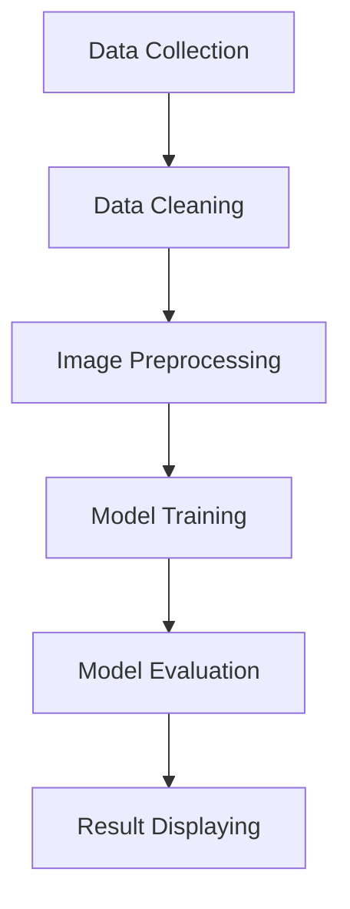

  <h1> Chronic Kidney Disease Classification System</h1>
  
<strong>End-to-End Machine Learning Pipeline for Medical Diagnosis</strong>

##  Project Overview
This project focuses on the early detection of Chronic Kidney Disease (CKD) using Deep Learning. Below is the complete Machine Learning pipeline implemented to achieve clinical-grade results.

##  Machine Learning Pipeline

### 1. Data Collection
- **Source**: Sourced balanced datasets of kidney medical imaging (CT/Ultrasound) including both CKD and Normal cases.
- **Diversity**: Included multiple imaging formats, including professional DICOM (`.dcm`) files.

### 2. Data Cleaning
- **Outlier Removal**: Removed corrupt images and irrelevant artifacts.
- **Handling Mismatches**: Standardized metadata across different imaging sources.
- **Filtering**: Verified ground-truth labels alongside medical benchmarks.

### 3. Image Preprocessing
- **Rescaling**: Pixel normalization to a $[0, 1]$ range for model stability.
- **Resizing**: Standardized all input images to $224 \times 224$ pixels.
- **Augmentation**: Applied random rotations, flips, and zooms to improve model robustness and prevent overfitting.

### 4. Model Training
- **Architecture**: A hybrid transfer-learning approach using **InceptionV3** and **MobileNetV2**.
- **Optimization**: Used Adam optimizer with a custom learning rate scheduler.
- **Hyperparameter Tuning**: Leveraged `keras-tuner` to find the optimal layer configuration and dropout rates.

### 5. Model Evaluation
- **Metrics**: Validated using Accuracy, **Precision**, **Recall**, and **F1-Score**.
- **Visualization**: Generated **Confusion Matrices** and **ROC Curves** to assess performance.
- **Explainability**: Integrated **Grad-CAM** to ensure the model focuses on pathologically relevant kidney features.

### 6. Result Displaying
- **Real-Time Dashboard**: Interactive UI for immediate diagnostic feedback.
- **XAI Visualization**: Overlaying Grad-CAM heatmaps on original scans for clinical verification.
- **3D Volume Analysis**: Layer-by-layer slice scrolling for deeper medical inspection.

## Getting Started
1. **Frontend**: `npm run dev`
2. **Backend**: `npm run backend:dev`
